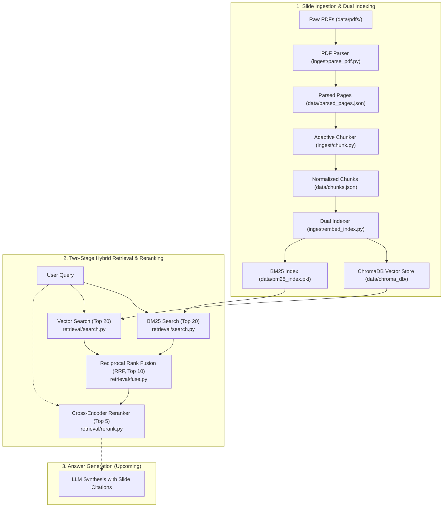

# Hybrid Search RAG

A Hybrid Search Retrieval-Augmented Generation (RAG) system built from scratch to index, search, and answer questions over lecture slide decks using a combination of dense semantic search, sparse keyword retrieval, Reciprocal Rank Fusion (RRF), and Cross-Encoder semantic reranking.

The project implements a complete slide ingestion, adaptive chunking, dual dense (ChromaDB + Ollama) / sparse (BM25) indexing, and a two-stage hybrid retrieval pipeline with comprehensive unit and integration tests.

---

## Architecture Overview



---

## Dataset

The dataset contains monthly lecture slide decks for **CSET340: Advanced Computer Vision and Video Analytics** (Jan 2026 – Apr 2026), located under `data/pdfs/`:

| File | Extracted Date Range / Week Label | Description |
| :--- | :--- | :--- |
| `jan_2026.pdf` | `5-9 Jan 2026` | Course intro, fundamentals, early vision |
| `feb_2026.pdf` | `2-6 Feb 2026` | Features, geometric transformations, alignment |
| `march_2026.pdf` | `16-20 March 2026` | Motion estimation, optical flow, video analytics |
| `april_2026.pdf` | `6-10 April 2026` | Camera calibration, 3D reconstruction, stereo vision |

> [!NOTE]
> Instead of fragile, hand-maintained lookup tables, date ranges are dynamically parsed directly from each deck's cover slide text via regex (`extract_week_label`), with graceful fallback to sanitized filenames (`week_label_for`).

---

## Ingestion & Indexing Pipeline

The pipeline is designed specifically for presentation slides, respecting slide boundaries, adapting dynamically to content density, and indexing chunks across both dense and sparse representations.

### Step 1: Slide-Aware PDF Parsing (`ingest/parse_pdf.py`)

- **Per-Slide Extraction**: Uses [PyMuPDF](https://pymupdf.readthedocs.io/) (`pymupdf`) to extract selectable text page-by-page, preserving natural topic and slide boundaries.
- **Dynamic Metadata Derivation**: Automatically pulls course dates from slide 1 content.
- **Text Normalization**: 
  - Collapses runs of spaces and horizontal tabs.
  - Normalizes 3+ newlines into `\n\n` (preserving double-newlines as downstream paragraph delimiters).
  - Skips near-empty or image-only slides (< 5 characters) to prevent noise.
- **Output**: Writes `data/parsed_pages.json` with records containing `{source, week, slide, text}`.

### Step 2: Adaptive Slide Chunking (`ingest/chunk.py`)

Slides vary wildly in density—some are minimal title slides, while others contain dense mathematical explanations. The chunker adapts to both:

- **Adaptive Merging for Thin Slides (`MIN_CHARS = 120`)**:
  - Slides with fewer than 120 characters (such as title or section transition slides) are buffered and merged forward with subsequent slides from the same PDF (e.g., labeled `slides 1-2`).
  - Strict document-boundary check ensures slides are **never** merged across different PDFs.
- **Adaptive Splitting for Dense Slides (`MAX_CHARS = 1400`)**:
  - Slides exceeding 1400 characters are greedily split across `\n\n` paragraph boundaries.
  - Fallback window-slicing handles oversized paragraphs lacking newline breaks.
- **Normalized Schema**:
  ```json
  {
    "chunk_id": "c0001",
    "source": "april_2026.pdf",
    "week": "6-10 April 2026",
    "slide_label": "slides 1-2",
    "text": "..."
  }
  ```
- **Output**: Writes `data/chunks.json` and outputs summary statistics (min, max, average chunk size).

### Step 3: Dual Indexing — Dense Embeddings & Sparse BM25 (`ingest/embed_index.py`)

To achieve true hybrid search, chunks are indexed into two complementary engines:

- **Dense Semantic Embeddings (ChromaDB + Ollama)**:
  - Generates 768-dimensional semantic embeddings using local Ollama (`nomic-embed-text`).
  - Persists vectors, documents, and slide metadata (`source`, `week`, `slide_label`) in ChromaDB (`data/chroma_db/`) under the `cv_course` collection.
  - Features dependency injection (`EmbedFn`) to decouple the embedding backend and enable fast, deterministic unit testing without requiring an active Ollama instance.
- **Sparse Lexical Search (BM25Okapi)**:
  - Tokenizes slide text into normalized lowercase alphanumeric terms via regex.
  - Computes BM25 corpus statistics using `rank_bm25` for fast, exact keyword retrieval (e.g., matching acronyms, technical terms, and formulas).
  - Serializes the BM25 index and chunk references to disk (`data/bm25_index.pkl`).

---

## Hybrid Retrieval & Reranking Pipeline

Pure lexical search (BM25) fails when users use synonyms or conceptual descriptions, while pure vector search often misses precise keywords, domain acronyms (e.g., `CLAHE`), or mathematical notation. Our hybrid pipeline bridges this gap using a two-stage retrieval and reranking strategy.

```text
                  USER QUERY
                      │
           "What is camera calibration?"
                      │
             ┌────────┴────────┐
             ↓                 ↓
        BM25 Search       Vector Search       (Stage 1: Candidate Generation)
        (Top 20 IDs)      (Top 20 IDs)
             │                 │
             └────────┬────────┘
                      ↓
           Reciprocal Rank Fusion (RRF)       (Stage 2: Rank-Based Fusion)
                      ↓
                 Top 10 Chunks
                      ↓
             Cross-Encoder Reranker           (Stage 3: Deep Relevance Scoring)
       (ms-marco-MiniLM-L-6-v2)
                      ↓
             Top 5 Final Chunks               (Context for LLM Answer Generation)
```

### Step 4: First-Stage Candidate Retrieval (`retrieval/search.py`)

- **Sparse BM25 Search (`search_bm25`)**: Tokenizes the input query, scores chunks against precomputed term frequencies, and retrieves the top 20 candidate chunk IDs.
- **Dense Vector Search (`search_vector`)**: Embeds the query using `nomic-embed-text` via Ollama and queries the ChromaDB collection for nearest neighbors via cosine distance, retrieving the top 20 candidate chunk IDs.
- **Index Loaders**: Clean loader helpers (`load_bm25_index`, `load_vector_index`) abstract disk serialization details.

### Step 5: Reciprocal Rank Fusion (`retrieval/fuse.py`)

#### The Problem RRF Solves
BM25 scores and cosine-similarity scores live on completely different, incompatible scales:
- BM25 scores are unbounded and corpus-dependent (e.g., a score of `14.2` has no inherent scale).
- Cosine similarity is bounded $[-1, 1]$.

Direct score normalization or weighted sums are fragile and skewed by outliers. 

#### RRF Algorithm
Reciprocal Rank Fusion discards arbitrary raw scores and operates strictly on **rank positions**:

$$\text{RRF Score}(d) = \sum_{m \in M} \frac{1}{k + r_m(d)}$$

- $r_m(d)$ is the 1-based rank position of chunk $d$ in system $m$.
- If a chunk was not retrieved by a method, its contribution from that method is 0.
- $k$ is a smoothing constant (default: `60`) that controls the score drop-off between adjacent ranks.
- Chunks discovered by **both** BM25 and vector search receive additive score boosts, naturally surfacing consensus results.
- **Output**: Returns the top 10 fused candidate chunk IDs (`fuse_top_k`).

### Step 6: Cross-Encoder Semantic Reranking (`retrieval/rerank.py`)

Bi-encoders (like the embedding model used in vector search) compute representations for the query and document independently, missing fine-grained token-level cross-attention.

- **Cross-Encoder Model**: Uses `cross-encoder/ms-marco-MiniLM-L-6-v2` via `sentence-transformers`.
- **Full Joint Attention**: Feeds `(query, document_text)` pairs simultaneously into the transformer, capturing word order, negation, syntactic dependencies, and nuance.
- **Relevance Scoring**: Reranks the top 10 candidates by predicted logit scores and selects the top 5 highest-quality chunks.
- **Metadata Preservation**: Retains complete chunk objects (`chunk_id`, `source`, `week`, `slide_label`, `text`) for downstream citation generation.

### Step 7: End-to-End Hybrid Orchestrator & Diagnostics (`retrieval/hybrid_retrieve.py`)

- **Unified Interface (`retrieve`)**: Orchestrates dual retrieval $\rightarrow$ RRF $\rightarrow$ Cross-Encoder reranking in a single callable.
- **Side-by-Side Comparison (`compare_methods`)**: Diagnostic harness that runs queries across three modes simultaneously:
  1. BM25 only (top 3)
  2. Vector search only (top 3)
  3. Fused + Cross-Encoder reranked (top 3)

---

## Project Structure

```text
RAG-with-Hybrid-Search/
├── data/
│   ├── pdfs/                     # Raw course slide PDFs
│   │   ├── jan_2026.pdf
│   │   ├── feb_2026.pdf
│   │   ├── march_2026.pdf
│   │   └── april_2026.pdf
│   ├── parsed_pages.json         # Output of parse_pdf.py
│   ├── chunks.json               # Output of chunk.py
│   ├── chroma_db/                # Persistent ChromaDB vector store (gitignored)
│   └── bm25_index.pkl            # Serialized BM25Okapi index & corpus (gitignored)
├── ingest/
│   ├── parse_pdf.py              # Step 1: PDF extraction & cleaning
│   ├── chunk.py                  # Step 2: Slide-aware adaptive chunking
│   └── embed_index.py            # Step 3: Dense (Chroma) & Sparse (BM25) indexing
├── retrieval/
│   ├── search.py                 # Step 4: Parallel BM25 & vector search
│   ├── fuse.py                   # Step 5: Reciprocal Rank Fusion (RRF)
│   ├── rerank.py                 # Step 6: Cross-Encoder semantic reranker
│   └── hybrid_retrieve.py        # Step 7: End-to-end pipeline & comparison runner
├── tests/
│   ├── test_parse_pdf.py         # Unit & integration tests for parser
│   ├── test_chunk.py             # Unit tests for chunking & merge/split rules
│   ├── test_embed_index.py       # Unit & integration tests for embeddings & BM25
│   ├── test_search.py            # Unit tests for BM25 and vector search
│   ├── test_fuse.py              # Unit tests for RRF algorithm & properties
│   └── test_rerank.py            # Unit & integration tests for cross-encoder reranker
├── requirements.txt              # Project dependencies
├── .gitignore                    # Ignored virtualenvs, local indexes & OS artifacts
├── LICENSE                       # License information
└── README.md
```

---

## Setup & Running

### 1. Environment & Dependencies

Create a virtual environment and install the required dependencies:

```bash
# Create and activate virtual environment
python3 -m venv venv
source venv/bin/activate

# Install dependencies
pip install -r requirements.txt
```

### 2. Configure Ollama (Local Embeddings)

Ensure [Ollama](https://ollama.com/) is installed and running with the embedding model:

```bash
# Start Ollama service (in a split terminal if not running as a system service)
ollama serve

# Pull the embedding model
ollama pull nomic-embed-text
```

### 3. Run the Ingestion & Indexing Pipeline

Execute the ingestion and indexing stages in order:

```bash
# Step 1: Parse PDFs into parsed_pages.json
python3 ingest/parse_pdf.py

# Step 2: Build adaptive chunks into chunks.json
python3 ingest/chunk.py

# Step 3: Generate ChromaDB vector index and BM25 index
python3 ingest/embed_index.py
```

### 4. Run Hybrid Retrieval

Run the end-to-end hybrid retrieval demo to see side-by-side comparisons of BM25, Vector Search, and Fused + Reranked results across test queries:

```bash
python3 retrieval/hybrid_retrieve.py
```

Sample output:
```text
======================================================================
QUERY : What is the extrinsic matrix of a camera?
======================================================================

--- BM25 only (top 3) ---
 [capril_2026.pdf, slides 19-20] Camera Calibration...
 [capril_2026.pdf, slide 11] Camera Calibration Extrinsic parameter...

--- Vector only (top 3) ---
  [april_2026.pdf, slides 14-15] Camera Calibration...
  [april_2026.pdf, slide 11] Camera Calibration Extrinsic parameter...

--- Fused + reranked (top 3) ---
  [april_2026.pdf, slide 11] Camera Calibration Extrinsic parameter...
  [april_2026.pdf, slides 14-15] Camera Calibration...
```

### 5. Run Tests

Run the full test suite via `pytest`:

```bash
pytest -v
```

Or run individual test suites:

```bash
pytest tests/test_parse_pdf.py -v
pytest tests/test_chunk.py -v
pytest tests/test_embed_index.py -v
pytest tests/test_search.py -v
pytest tests/test_fuse.py -v
pytest tests/test_rerank.py -v
```

#### Test Architecture (37 tests)
- **Pure Unit Tests**: Fast, deterministic logic testing without network, disk, or model dependencies:
  - Text cleaning and regex date extraction (`test_parse_pdf.py`)
  - Adaptive sliding window merging and paragraph splitting (`test_chunk.py`)
  - Regex tokenization (`test_embed_index.py`)
  - Reciprocal Rank Fusion properties, rank sensitivities, and damping parameter $k$ (`test_fuse.py`)
- **Dependency-Injected Tests**:
  - `embed_chunks()` and `search_vector()` tested with a deterministic fake embedding function and ephemeral ChromaDB (`test_embed_index.py`, `test_search.py`).
  - `rerank()` tested with a deterministic fake word-overlap scorer (`test_rerank.py`).
- **Graceful Integration Tests**:
  - Real PDF parsing against `data/pdfs/` (auto-skipped if PDFs are missing).
  - Real Ollama embedding against local daemon (auto-skipped if Ollama is unreachable).
  - Real Cross-Encoder scoring (`cross-encoder/ms-marco-MiniLM-L-6-v2`) against sample queries (auto-skipped if model download is unavailable).

---

## Next Steps

- [x] **Slide-Aware Ingestion**: Per-page PDF extraction with metadata extraction.
- [x] **Adaptive Chunking**: Dynamic merging of thin slides and paragraph-aware splitting of dense slides.
- [x] **Dense Vector Store**: ChromaDB persistence with Ollama `nomic-embed-text` embeddings.
- [x] **Sparse Keyword Index**: Lexical search with BM25Okapi serialized to disk.
- [x] **Two-Stage Hybrid Search**: Reciprocal Rank Fusion (RRF) combining dense and sparse candidate pools.
- [x] **Cross-Encoder Reranking**: Re-scoring top candidates with `cross-encoder/ms-marco-MiniLM-L-6-v2`.
- [x] **Automated Test Suite**: 37 comprehensive unit and integration tests across all pipeline modules.
- [ ] **LLM Generation & Slide Citation**: Ground LLM answers with precise slide citations (e.g., `"April 2026, slides 1-2"`).
- [ ] **Evaluation Harness**: Retrieval benchmarking with Mean Reciprocal Rank (MRR) and Hit Rate@K.