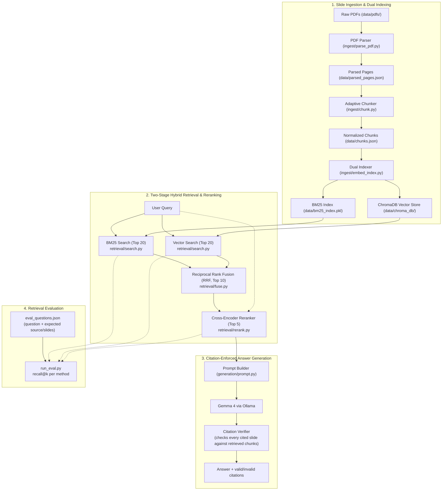

# Hybrid Search RAG

A Hybrid Search Retrieval-Augmented Generation (RAG) system built from scratch to index, search, and answer questions over lecture slide decks using a combination of dense semantic search, sparse keyword retrieval, Reciprocal Rank Fusion (RRF), Cross-Encoder semantic reranking, and citation-enforced LLM generation.

The project implements a complete slide ingestion, adaptive chunking, dual dense (ChromaDB + Ollama) / sparse (BM25) indexing, a two-stage hybrid retrieval pipeline, citation-verified answer generation via a local LLM (Gemma 4 / Ollama), a retrieval evaluation harness, and comprehensive unit and integration tests throughout.

---

## Architecture Overview



---

## Dataset

The dataset contains monthly lecture slide decks for **CSET340: Advanced Computer Vision and Video Analytics** (Jan 2026 – Apr 2026), located under `data/pdfs/`:

| File | Extracted Date Range / Week Label | Description |
| :--- | :--- | :--- |
| `jan_2026.pdf` | `5-9 Jan 2026` | Course intro, fundamentals, early vision |
| `feb_2026.pdf` | `2-6 Feb 2026` | Features, geometric transformations, alignment |
| `march_2026.pdf` | `16-20 March 2026` | Motion estimation, optical flow, video analytics |
| `april_2026.pdf` | `6-10 April 2026` | Camera calibration, 3D reconstruction, stereo vision |

> [!NOTE]
> Instead of fragile, hand-maintained lookup tables, date ranges are dynamically parsed directly from each deck's cover slide text via regex (`extract_week_label`), with graceful fallback to sanitized filenames (`week_label_for`).

> [!WARNING]
> `april_2026.pdf` actually spans **two** course weeks (6-10 April and 13-17 April), each with its own cover slide. `extract_week_label` currently reads only page 1's date range and applies it to the whole file, so slides from the second week are mislabeled as `6-10 April 2026`. Tracked as a known issue, to be fixed before the ingestion layer is considered final.

---

## Ingestion & Indexing Pipeline

*(Steps 1-3 unchanged from the ingestion stage — see inline docstrings in `ingest/` for full detail.)*

### Step 1: Slide-Aware PDF Parsing (`ingest/parse_pdf.py`)
Per-slide text extraction via PyMuPDF, dynamic week-label derivation from cover-slide text, whitespace normalization, near-empty slide skipping. Outputs `data/parsed_pages.json`.

### Step 2: Adaptive Slide Chunking (`ingest/chunk.py`)
Merges thin slides (< `MIN_CHARS = 120`) forward into the next slide from the same PDF; splits dense slides (> `MAX_CHARS = 1400`) on paragraph boundaries, with a hard character-split fallback for oversized single paragraphs. Outputs `data/chunks.json`.

### Step 3: Dual Indexing — Dense Embeddings & Sparse BM25 (`ingest/embed_index.py`)
Builds a ChromaDB vector index (768-dim `nomic-embed-text` embeddings via Ollama) and a parallel BM25Okapi keyword index, both keyed by the same `chunk_id`. Uses dependency injection (`EmbedFn`) so indexing logic is unit-testable without a live Ollama instance.

---

## Hybrid Retrieval & Reranking Pipeline

*(Steps 4-7 unchanged — full detail in `retrieval/` docstrings.)*

Pure lexical search (BM25) fails on synonyms/conceptual phrasing; pure vector search often misses precise keywords, acronyms (`CLAHE`), or notation (`fx`, `fy`). The two-stage pipeline (BM25 top-20 + vector top-20 → RRF fusion → top-10 → cross-encoder rerank → top-5) bridges this gap.

### Step 4: First-Stage Candidate Retrieval (`retrieval/search.py`)
### Step 5: Reciprocal Rank Fusion (`retrieval/fuse.py`)

$$\text{RRF Score}(d) = \sum_{m \in M} \frac{1}{k + r_m(d)}$$

Fuses on rank position (not raw score) so BM25's unbounded scores and vector search's bounded cosine similarities never need to be reconciled directly.

### Step 6: Cross-Encoder Semantic Reranking (`retrieval/rerank.py`)
`cross-encoder/ms-marco-MiniLM-L-6-v2` jointly scores `(query, document)` pairs — full cross-attention, too expensive to run on the whole corpus, cheap enough on the fused top-10.

### Step 7: End-to-End Hybrid Orchestrator & Diagnostics (`retrieval/hybrid_retrieve.py`)
`retrieve()` chains all of the above; `compare_methods()` prints BM25-only / vector-only / fused+reranked side by side for manual inspection.

---

## Citation-Enforced Answer Generation (`generation/prompt.py`)

Retrieval alone doesn't answer a question — a local LLM (**Gemma 4**, via Ollama) synthesizes the final answer from the top-5 reranked chunks, under an explicit grounding contract, with the output **verified in code**, not just requested in the prompt.

### Prompting Rules
The system prompt requires the model to:
1. Use only the provided slide excerpts — no outside knowledge.
2. Cite every claim in the exact format `[source_file.pdf, slide N]`, copied verbatim from the excerpt header.
3. Reply with a fixed refusal string if the excerpts don't cover the question.

### Citation Verification (`verify_citations`)
Prompting reduces hallucinated citations but cannot guarantee their absence — a fluent model can still fabricate a plausible-looking `[source, slide]` tag. So every citation the model outputs is parsed via regex and checked against the chunks *actually retrieved* for that query:
- **Valid**: source file matches a retrieved chunk AND the cited slide number overlaps that chunk's `slide_label` (handles merged ranges like `slides 1-2` correctly via set intersection, not string equality).
- **Invalid**: anything else — flagged, not silently trusted.

If retrieval returns zero chunks, the system refuses **without calling the model at all** — cheaper, and impossible to hallucinate from no context.

### Example (real output, Gemma 4 via Ollama)

```
Q: Why do we need two different focal lengths fx and fy?

A: You use different focal lengths ($F_x$ and $F_y$) in order to accommodate
non-equal pixel density in the x and y directions [april_2026.pdf, slide 7].
This is necessary if the pixels are rectangular [april_2026.pdf, slide 7].

valid:   [('april_2026.pdf', 'slide 7'), ('april_2026.pdf', 'slide 7')]
invalid: []
```

Both citations verified against the actually-retrieved chunk — zero invalid citations on this query.

---

## Retrieval Evaluation Harness (`eval/run_eval.py`)

Citation verification checks *generation* faithfulness; it says nothing about whether retrieval found the *right* slide in the first place. The eval harness measures that separately via **recall@k**: for each question in `eval/eval_questions.json` (with a hand-labeled expected source PDF + slide numbers), is a chunk from the expected slide anywhere in the top-k results?

```bash
python3 eval/run_eval.py
```

Reports recall@5 for BM25-only, vector-only, and hybrid+rerank side by side, so a pipeline change (chunk size, RRF's `k`, rerank cutoff) can be checked for regressions before being trusted.

> [!WARNING]
> **Current result on the initial 10-question set: all three methods score 100% recall@5.** This does **not** mean hybrid search is proven superior — it means the current eval set is too easy to discriminate between methods (every question's phrasing is close enough to the source slide's wording that any single method finds it). The set needs harder, more paraphrased questions — and coverage across all four PDFs, not just April — before recall@5 numbers are meaningful for comparing methods or reporting externally. Tracked as a follow-up before these numbers go anywhere near a resume.

`eval_questions.json` format:
```json
{
  "question": "Why do we use different focal lengths fx and fy?",
  "expected_source": "april_2026.pdf",
  "expected_slides": [7]
}
```

---

## Project Structure

```text
RAG-with-Hybrid-Search/
├── data/
│   ├── pdfs/                     # Raw course slide PDFs
│   │   ├── jan_2026.pdf
│   │   ├── feb_2026.pdf
│   │   ├── march_2026.pdf
│   │   └── april_2026.pdf
│   ├── parsed_pages.json         # Output of parse_pdf.py
│   ├── chunks.json               # Output of chunk.py
│   ├── chroma_db/                # Persistent ChromaDB vector store (gitignored)
│   └── bm25_index.pkl            # Serialized BM25Okapi index & corpus (gitignored)
├── ingest/
│   ├── parse_pdf.py              # Step 1: PDF extraction & cleaning
│   ├── chunk.py                  # Step 2: Slide-aware adaptive chunking
│   └── embed_index.py            # Step 3: Dense (Chroma) & Sparse (BM25) indexing
├── retrieval/
│   ├── search.py                 # Step 4: Parallel BM25 & vector search
│   ├── fuse.py                   # Step 5: Reciprocal Rank Fusion (RRF)
│   ├── rerank.py                 # Step 6: Cross-Encoder semantic reranker
│   └── hybrid_retrieve.py        # Step 7: End-to-end pipeline & comparison runner
├── generation/
│   └── prompt.py                 # Citation-enforced prompt building, generation, verification
├── eval/
│   ├── eval_questions.json       # Hand-labeled question -> expected source/slides
│   └── run_eval.py               # recall@k evaluation across BM25/vector/hybrid
├── tests/
│   ├── test_parse_pdf.py         # Unit & integration tests for parser
│   ├── test_chunk.py             # Unit tests for chunking & merge/split rules
│   ├── test_embed_index.py       # Unit & integration tests for embeddings & BM25
│   ├── test_search.py            # Unit tests for BM25 and vector search
│   ├── test_fuse.py              # Unit tests for RRF algorithm & properties
│   ├── test_rerank.py            # Unit & integration tests for cross-encoder reranker
│   ├── test_prompt.py            # Unit tests for prompt building & citation verification
│   └── test_eval.py              # Unit tests for the recall@k metric itself
├── requirements.txt              # Project dependencies
├── .gitignore                    # Ignored virtualenvs, local indexes & OS artifacts
├── LICENSE                       # License information
└── README.md
```

---

## Setup & Running

### 1. Environment & Dependencies

```bash
python3 -m venv venv
source venv/bin/activate
pip install -r requirements.txt
```

### 2. Configure Ollama (Local Embeddings + Generation)

```bash
ollama serve
ollama pull nomic-embed-text
ollama pull gemma4
```

### 3. Run the Ingestion & Indexing Pipeline

```bash
python3 ingest/parse_pdf.py
python3 ingest/chunk.py
python3 ingest/embed_index.py
```

### 4. Run Hybrid Retrieval (diagnostics)

```bash
python3 retrieval/hybrid_retrieve.py
```

### 5. Generate a Citation-Verified Answer

```bash
python3 -c "
import sys; sys.path.insert(0,'generation'); sys.path.insert(0,'retrieval'); sys.path.insert(0,'ingest')
from prompt import generate_answer, ollama_chat
from search import load_bm25_index, load_vector_index
from hybrid_retrieve import retrieve, build_chunk_lookup
bm25, chunks = load_bm25_index(); col = load_vector_index(); lk = build_chunk_lookup(chunks)
q = 'Why do we need two different focal lengths fx and fy?'
r = generate_answer(q, retrieve(q, bm25, chunks, col, lk), ollama_chat)
print(r['answer']); print('valid:', r['citations_valid']); print('invalid:', r['citations_invalid'])
"
```

### 6. Run the Retrieval Evaluation Harness

```bash
python3 eval/run_eval.py
```

### 7. Run Tests

```bash
pytest -v
```

Or individually:

```bash
pytest tests/test_parse_pdf.py -v
pytest tests/test_chunk.py -v
pytest tests/test_embed_index.py -v
pytest tests/test_search.py -v
pytest tests/test_fuse.py -v
pytest tests/test_rerank.py -v
pytest tests/test_prompt.py -v
pytest tests/test_eval.py -v
```

#### Test Architecture (53 tests)
- **Pure Unit Tests**: Fast, deterministic logic testing without network, disk, or model dependencies — text cleaning/date regex, adaptive chunk merge/split, tokenization, RRF properties, citation regex parsing, slide-range overlap checks, and the recall@k metric itself (`test_eval.py` proves the metric is correct independent of any real retriever).
- **Dependency-Injected Tests**: `embed_chunks()`/`search_vector()` with a fake embedding function + ephemeral ChromaDB; `rerank()` with a fake word-overlap scorer; `generate_answer()` with a fake `chat_fn` — proving citation verification logic without ever calling Ollama.
- **Graceful Integration Tests**: real PDF parsing, real Ollama embedding, real cross-encoder scoring — each auto-skipped if its dependency (PDFs on disk / Ollama daemon / model download) isn't available.

---

## Next Steps

- [x] **Slide-Aware Ingestion**: Per-page PDF extraction with metadata extraction.
- [x] **Adaptive Chunking**: Dynamic merging of thin slides and paragraph-aware splitting of dense slides.
- [x] **Dense Vector Store**: ChromaDB persistence with Ollama `nomic-embed-text` embeddings.
- [x] **Sparse Keyword Index**: Lexical search with BM25Okapi serialized to disk.
- [x] **Two-Stage Hybrid Search**: Reciprocal Rank Fusion (RRF) combining dense and sparse candidate pools.
- [x] **Cross-Encoder Reranking**: Re-scoring top candidates with `cross-encoder/ms-marco-MiniLM-L-6-v2`.
- [x] **Citation-Enforced Generation**: Gemma 4 (Ollama) answers grounded in retrieved slides, with code-level citation verification against retrieved chunk IDs.
- [x] **Evaluation Harness**: recall@k across BM25-only, vector-only, and hybrid+rerank.
- [x] **Automated Test Suite**: 53 unit and integration tests across all pipeline modules.
- [ ] **Expand eval set**: grow past 10 questions, cover all four PDFs, include paraphrased (non-exact-wording) questions so recall@5 can actually discriminate between methods.
- [ ] **Fix April week-label bug**: `extract_week_label` needs to detect and label the second cover slide (13-17 April) separately.
- [ ] **Auth & Backend (FastAPI)**: JWT-based auth with admin/student roles.
- [ ] **Chat History**: Per-user persisted sessions and messages (SQLite).
- [ ] **Document Ingestion API**: Admin-gated endpoint to upload and re-index new PDFs.
- [ ] **Frontend**: Streamlit client (login, chat, history, admin upload) as a pure API consumer.