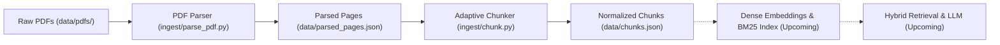

# Hybrid Search RAG

A Hybrid Search Retrieval-Augmented Generation (RAG) system built from scratch to index, search, and answer questions over lecture slide decks using a combination of dense semantic search and sparse keyword retrieval.

The project currently implements a complete, battle-tested slide ingestion and adaptive chunking pipeline with unit and integration tests.

---

## Architecture Overview



---

## Dataset

The dataset contains monthly lecture slide decks for **CSET340: Advanced Computer Vision and Video Analytics** (Jan 2026 – Apr 2026), located under `data/pdfs/`:

| File | Extracted Date Range / Week Label | Description |
| :--- | :--- | :--- |
| `jan_2026.pdf` | `5-9 Jan 2026` | Course intro, fundamentals, early vision |
| `feb_2026.pdf` | `2-6 Feb 2026` | Features, geometric transformations, alignment |
| `march_2026.pdf` | `16-20 March 2026` | Motion estimation, optical flow, video analytics |
| `april_2026.pdf` | `6-10 April 2026` | Camera calibration, 3D reconstruction, stereo vision |

> [!NOTE]
> Instead of fragile, hand-maintained lookup tables, date ranges are dynamically parsed directly from each deck's cover slide text via regex (`extract_week_label`), with graceful fallback to sanitized filenames (`week_label_for`).

---

## Ingestion Pipeline

The ingestion pipeline is designed specifically for presentation slides, respecting slide boundaries and adapting dynamically to content density.

### Step 1: Slide-Aware PDF Parsing (`ingest/parse_pdf.py`)

- **Per-Slide Extraction**: Uses [PyMuPDF](https://pymupdf.readthedocs.io/) (`pymupdf`) to extract selectable text page-by-page, preserving natural topic and slide boundaries.
- **Dynamic Metadata Derivation**: Automatically pulls course dates from slide 1 content.
- **Text Normalization**: 
  - Collapses runs of spaces and horizontal tabs.
  - Normalizes 3+ newlines into `\n\n` (preserving double-newlines as downstream paragraph delimiters).
  - Skips near-empty or image-only slides (< 5 characters) to prevent noise.
- **Output**: Writes `data/parsed_pages.json` with records containing `{source, week, slide, text}`.

### Step 2: Adaptive Slide Chunking (`ingest/chunk.py`)

Slides vary wildly in density—some are minimal title slides, while others contain dense mathematical explanations. The chunker adapts to both:

- **Adaptive Merging for Thin Slides (`MIN_CHARS = 120`)**:
  - Slides with fewer than 120 characters (such as title or section transition slides) are buffered and merged forward with subsequent slides from the same PDF (e.g., labeled `slides 1-2`).
  - Strict document-boundary check ensures slides are **never** merged across different PDFs.
- **Adaptive Splitting for Dense Slides (`MAX_CHARS = 1400`)**:
  - Slides exceeding 1400 characters are greedily split across `\n\n` paragraph boundaries.
  - Fallback window-slicing handles oversized paragraphs lacking newline breaks.
- **Normalized Schema**:
  ```json
  {
    "chunk_id": "c0001",
    "source": "april_2026.pdf",
    "week": "6-10 April 2026",
    "slide_label": "slides 1-2",
    "text": "..."
  }
  ```
- **Output**: Writes `data/chunks.json` and outputs summary statistics (min, max, average chunk size).

---

## Project Structure

```text
RAG-with-Hybrid-Search/
├── data/
│   ├── pdfs/                     # Raw course slide PDFs
│   │   ├── jan_2026.pdf
│   │   ├── feb_2026.pdf
│   │   ├── march_2026.pdf
│   │   └── april_2026.pdf
│   ├── parsed_pages.json         # Output of parse_pdf.py
│   └── chunks.json               # Output of chunk.py
├── ingest/
│   ├── parse_pdf.py              # Step 1: PDF extraction & cleaning
│   └── chunk.py                  # Step 2: Slide-aware adaptive chunking
├── tests/
│   ├── test_parse_pdf.py         # Unit & integration tests for parser
│   └── test_chunk.py             # Unit tests for chunking & merge/split rules
├── requirements.txt              # Project dependencies
├── LICENSE                       # License information
└── README.md
```

---

## Setup & Running

### 1. Environment & Dependencies

Create a virtual environment and install the required dependencies:

```bash
# Create and activate virtual environment
python3 -m venv venv
source venv/bin/activate

# Install dependencies
pip install -r requirements.txt
```

### 2. Run the Ingestion Pipeline

Execute the two pipeline steps in order:

```bash
# Step 1: Parse PDFs into parsed_pages.json
python ingest/parse_pdf.py

# Step 2: Build chunks into chunks.json
python ingest/chunk.py
```

### 3. Run Tests

Run the test suite via `pytest`:

```bash
pytest -v
```

Or run individual test suites:

```bash
pytest tests/test_parse_pdf.py -v
pytest tests/test_chunk.py -v
```

The test suite includes:
- **Unit tests**: Pure functions (`extract_week_label`, `clean_text`, `split_dense_page`, `build_chunks`) tested in isolation with synthetic test fixtures.
- **Integration tests**: End-to-end extraction against real PDF files in `data/pdfs/` (safely auto-skipped if PDFs are absent).

---

## Next Steps

- [x] **Slide-Aware Ingestion**: Per-page PDF extraction with metadata extraction.
- [x] **Adaptive Chunking**: Dynamic merging of thin slides and paragraph-aware splitting of dense slides.
- [x] **Automated Test Suite**: Unit and integration tests covering extraction and chunking edge cases.
- [ ] **Dense Vector Embeddings**: Generate semantic embeddings for chunks (e.g. using `sentence-transformers` or OpenAI).
- [ ] **Sparse Keyword Index**: Implement BM25 lexical search (e.g. using `rank-bm25`).
- [ ] **Vector Store**: Index chunk metadata and embeddings into a vector database.
- [ ] **Hybrid Search & Fusion**: Combine dense and sparse candidate lists using Reciprocal Rank Fusion (RRF).
- [ ] **LLM Generation & Slide Citation**: Ground LLM answers with precise slide citations (e.g., `"April 2026, slides 1-2"`).